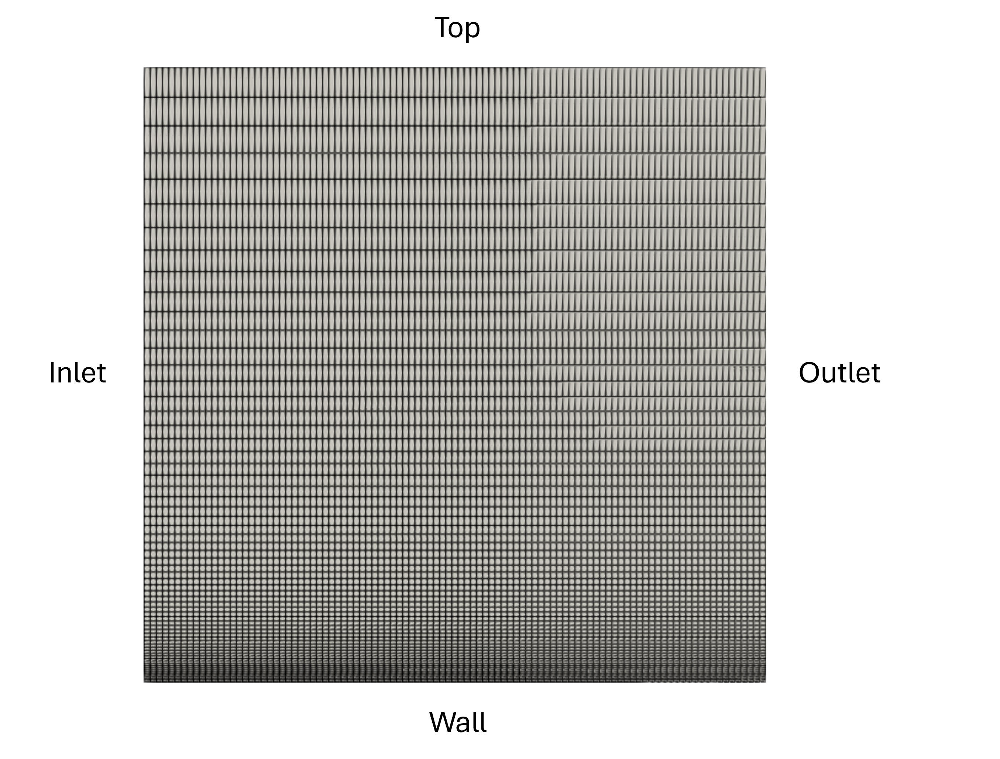

# Validation: 2D Constant temperature flat plate

# Introduction
---
A 2D constant temperature laminar flat plate case has been used to validate the weakly 
compressible solver. The case provides a constant temperature boundary condition along the 
wall of the domain. 

The Nusselt number values obtained from the simulation are compared against the theoretical local Nusselt number correlation 
for forced convection on constant temperature flat plate:

``Nu_x = 0.332 Re_x^{1/2} Pr^{1/3}``

The correlation is valid for Prandtl numbers greater than 0.6.

## Boundary conditions

### Inlet


| Field | Boundary condition      |
| -------  | ---------- |
| ``U``   |  Dirichlet ([0.2, 0.0, 0.0] m/s)   |
| ``p``   |  Neumann (Zero-gradient)      |
| ``T ``  |  FixedTemperature (300.0 K)    |

### Wall


| Field | Boundary condition      |
| -------  | ---------- |
| ``U``   |  No-slip wall   |
| ``p``   |  Neumann (Zero-gradient)      |
| ``T ``  |  FixedTemperature (310.0 K)    |

### Outlet


| Field | Boundary condition      |
| -------  | ---------- |
| ``U``   |  Neumann (Zero-gradient)   |
| ``p``   |  Dirichlet (0.0 Pa)     |
| ``T ``  |  Neumann (Zero-gradient)    |

### Top


| Field | Boundary condition      |
| -------  | ---------- |
| ``U``   |  Neumann (Zero-gradient)   |
| ``p``   |  Neumann (Zero-gradient)     |
| ``T ``  |  Neumann (Zero-gradient)    |


# Fluid Properties


| Property | value      |
| -------  | ---------- |
| ``\nu``   |  0.0001    |
| ``Pr``   |  0.71      |
| ``c_p``  |  1005.0    |
| ``\gamma`` | 1.4      |


# Mesh
---

The mesh is shown in the figure below. The plate is represented by the "wall" boundary. The flow moves from left to right ("inlet" to "outlet" boundaries). The x-axis is aligned with the wall boundary and the y-axis is position in the direction perpendicular to the wall.




The streamwise cell length is 2mm with a total domain length of 1m. The near-wall cell height is 0.049mm with a domain height of 0.2m.


# Case file
---

```jldoctest;  filter = r".*"s => s"", output = false
using XCALibre

grids_dir = pkgdir(XCALibre, "examples/0_GRIDS")
grid = "flatplate_2D_laminar.unv"
mesh_file = joinpath(grids_dir, grid)

mesh = UNV2D_mesh(mesh_file, scale=0.001)

velocity = [0.2, 0.0, 0.0]
nu = 1e-4
Re = velocity[1]*1/nu
cp = 1005.0
gamma = 1.4
Pr = 0.7

model = Physics(
    time = Steady(),
    fluid =  Fluid{WeaklyCompressible}(
        nu = nu,
        cp = cp,
        gamma = gamma,
        Pr = Pr
        ),
    turbulence = RANS{Laminar}(),
    energy = Energy{SensibleEnthalpy}(Tref = 288.15),
    domain = mesh # mesh_dev  # use mesh_dev for GPU backend
    )

@assign! model momentum U (
    Dirichlet(:inlet, velocity),
    Neumann(:outlet, 0.0),
    Wall(:wall, [0.0, 0.0, 0.0]),
    Symmetry(:top, 0.0)
)

 @assign! model momentum p (
    Neumann(:inlet, 0.0),
    Dirichlet(:outlet, 100000.0),
    Neumann(:wall, 0.0),
    Neumann(:top, 0.0)
)

@assign! model energy h (
    FixedTemperature(:inlet, T=300.0, model=model.energy),
    Neumann(:outlet, 0.0),
    FixedTemperature(:wall, T=310.0, model=model.energy),
    Neumann(:top, 0.0)
)

schemes = (
    U = set_schemes(divergence=Linear),
    p = set_schemes(divergence=Linear),
    h = set_schemes(divergence=Linear)
)

solvers = (
    U = set_solver(
        model.momentum.U;
        solver      = BicgstabSolver,
        preconditioner = Jacobi(),
        convergence = 1e-7,
        relax       = 0.7,
    ),
    p = set_solver(
        model.momentum.p;
        solver      = CgSolver,
        preconditioner = Jacobi(),
        convergence = 1e-7,
        relax       = 0.3,
    ),
    h = set_solver(
        model.energy.h;
        solver      = BicgstabSolver,
        preconditioner = Jacobi(),
        convergence = 1e-7,
        relax       = 0.7,
        rtol = 1e-2,
        atol = 1e-4
    )
)

runtime = set_runtime(iterations=1000, write_interval=1000, time_step=1)
runtime = set_runtime(iterations=1, write_interval=-1, time_step=1) # hide

hardware = set_hardware(backend=CPU(), workgroup=4)

config = Configuration(
    solvers=solvers, schemes=schemes, runtime=runtime, hardware=hardware)

GC.gc()

initialise!(model.momentum.U, velocity)
initialise!(model.momentum.p, 100000.0)
initialise!(model.energy.T, 300.0)

residuals = run!(model, config)

# output

```

# Results
---

The results of the model are compared to the theoretical correlation in the figure below:


